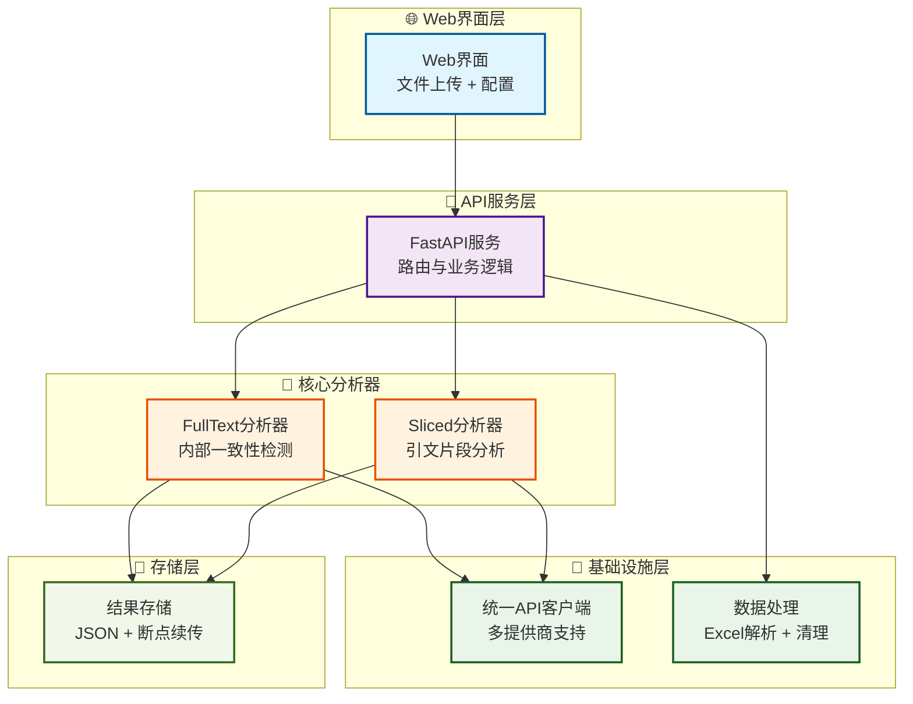

# AIQualityKit

**一个用于评估AI生成内容质量的工具集，支持多个API提供商的引文分析、一致性检查和幻觉检测。**

---

## 核心功能

*   **引文分析 (Citation Analysis)**：验证AI回答中引用的来源是否真实、相关。
*   **一致性评估 (Consistency Evaluation)**：检查AI在回答中是否存在前后矛盾或逻辑不一致的地方。
*   **幻觉检测 (Hallucination Detection)**：识别并标记出AI回答中可能包含的虚假或捏造的信息。
*   **多API支持**：统一支持阿里云百炼、OpenAI、DeepSeek等多个AI服务提供商。
*   **Web界面**：提供一个简单直观的前端页面，方便手动输入文本并获取即时分析结果。
*   **RESTful API**：提供标准API接口，便于集成到其他自动化测试流程中。
*   **批量处理**：支持Excel文件批量分析，提供断点续传功能。

## 快速开始

### 1. 环境设置

本项目使用 [uv](https://github.com/astral-sh/uv) 进行包和环境管理。

首先，进入项目目录：
```bash
cd path\to\AIQualityKit
```

接着，创建并激活虚拟环境：
```bash
# 创建 .venv 虚拟环境
uv venv

# 激活环境 (Windows)
.venv\Scripts\activate
```

### 2. 安装依赖

```bash
uv pip install -e .
```

### 3. 环境变量配置（可选）

如果你想在服务端配置默认的API密钥，可以设置环境变量：

```bash
# 阿里云百炼
set AL_KEY=你的百炼API密钥

# OpenAI
set OPENAI_API_KEY=你的OpenAI_API密钥

# DeepSeek
set DEEPSEEK_API_KEY=你的DeepSeek_API密钥

# NuwaAPI
set NUWA_KEY=你的Nuwa_API密钥
```

注意：即使没有设置环境变量，你也可以通过前端界面选择API提供商并输入API Key来使用所有功能。

### 4. 运行服务

```bash
# 使用UV运行服务器（推荐）
uv run uvicorn app.main:app --reload --host 127.0.0.1 --port 8000
```

服务启动后，访问 `http://127.0.0.1:8000` 即可看到前端界面。

#### 替代启动方式

如果你已经激活了虚拟环境，也可以直接使用：
```bash
uvicorn app.main:app --reload --host 127.0.0.1 --port 8000
```

## 如何使用

### Excel批量分析（推荐）

1. 通过浏览器访问 `http://127.0.0.1:8000`。
2. 在"配置"区域选择API提供商（阿里云、OpenAI、DeepSeek、NuwaAPI）并输入对应的API Key。
3. 在"文件上传"区域选择或拖拽Excel文件（.xlsx格式）。
4. 选择分析模式：
   - **Fulltext分析**：完整文本分析，分析完整的问答内容
   - **Sliced分析**：分段分析，支持同步/异步执行模式，分别分析标注句子的一致性
     - 同步模式：顺序处理，稳定可靠
     - 异步模式：并发处理，速度更快
5. 配置分析范围（前N条、特定rank、范围分析）。
6. 点击"开始分析"按钮。
7. 查看格式化的分析报告和详细结果。

### 文本直接分析

1. 滚动到页面下方的"文本分析"区域。
2. 在文本框中粘贴需要分析的AI生成内容。
3. 点击"分析文本"按钮。
4. 查看返回的JSON格式分析结果。

## 系统架构



### 🔧 核心组件说明

#### 1. Web界面层
- **用户交互**: 文件上传、API配置、实时结果展示
- **多格式支持**: Excel批量上传 + 单文本即时分析

#### 2. API服务层  
- **路由管理**: RESTful API设计，支持批量和单文本分析
- **业务逻辑**: 协调各分析器模块，处理并发请求

#### 3. 核心分析器
- **FullText分析器**: 
  - ⚠️ **核心功能**: 内部一致性检测（不依赖引文）
  - 🔍 自动清理思考过程，检测基础错误（如"11.9>13"）
- **Sliced分析器**: 引文片段的精准一致性分析

#### 4. 基础设施层
- **统一API客户端**: 支持阿里云、OpenAI、DeepSeek，智能重试与负载均衡
- **数据处理**: Excel解析、内容清理、并发优化

#### 5. 存储层
- **结果管理**: JSON格式存储、断点续传、版本控制

### 📈 数据流程

1. **上传阶段**: Excel文件 → 数据解析 → 提取问答对
2. **清理阶段**: 移除思考过程 → 获得纯净答案
3. **分析阶段**: 调用AI模型 → 检测内部一致性
4. **输出阶段**: 结构化结果 → JSON文件保存

### 🔄 重要更新：内部一致性检测

**新版幻觉检测**完全重写，现在支持：
- ✅ **无需引文**: 只分析问题+答案，完全不输入引文
- ✅ **自动清理**: 智能移除答案中的思考过程  
- ✅ **基础错误检测**: 专门捕获"11.9>13"等低级错误
- ✅ **逻辑一致性**: 检测前后矛盾、自相矛盾
- ✅ **五大类型**: 无问题/前后矛盾/逻辑错误/基础错误/自相矛盾

## 最近更新

### v1.2.0 (2025-08-30)
- ✅ **多API提供商支持**: 新增OpenAI、DeepSeek、NuwaAPI支持
- ✅ **统一API客户端架构**: 重构API调用逻辑，支持多提供商切换
- ✅ **Web界面优化**: 重新设计分析选项，支持执行模式选择
- ✅ **错误处理增强**: 修复所有字符串处理错误，提升系统稳定性
- ✅ **输出路径规范化**: 统一输出到`data/output/`目录
- ✅ **Token统计功能**: 添加详细的API调用和token使用统计
- ✅ **分批处理优化**: 改进大批量数据的处理策略

### 技术改进
- 修复了所有 `'dict' object has no attribute 'strip'` 错误
- 修复了所有 `'unhashable type: slice'` 错误  
- 改进了API响应解析的容错性
- 优化了Web界面的结果显示逻辑
- 增强了断点续传的可靠性

---

## 开发团队

- **主要开发**: AI Assistant with Claude Code
- **架构设计**: 统一API客户端 + 多分析器模块
- **技术栈**: FastAPI + AsyncIO + Pandas + OpenPyXL
